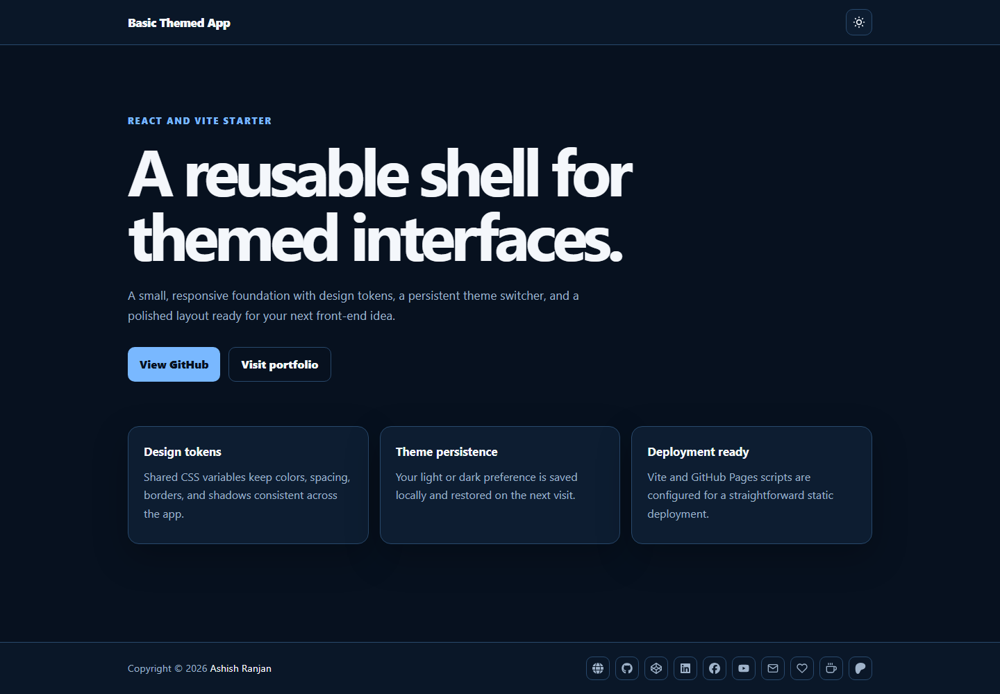

# Basic Themed App



A small Vite and React starter for building responsive interfaces with a persistent light and dark theme.

## Features

- Light and dark themes with local storage persistence.
- System theme fallback for first-time visitors.
- Responsive layout with a fixed header and icon-only footer links.
- Styled-components and CSS design tokens.
- GitHub Pages deployment setup.

## Tech stack

React 18, Vite, styled-components, React Icons, and CSS.

## Run locally

```powershell
npm install
npm run dev
```

Build and preview the production version:

```powershell
npm run build
npm run preview
```

Live URL: [a2rp.github.io/basic-themed-app](https://a2rp.github.io/basic-themed-app/)

## License

MIT License. See [LICENSE](LICENSE).

## Links

- Portfolio: [https://www.ashishranjan.net/](https://www.ashishranjan.net/)
- GitHub: [https://github.com/a2rp](https://github.com/a2rp)
- CodePen: [https://codepen.io/ash1198](https://codepen.io/ash1198)
- LinkedIn: [https://www.linkedin.com/in/aashishranjan](https://www.linkedin.com/in/aashishranjan)
- Facebook: [https://www.facebook.com/theash.ashish/](https://www.facebook.com/theash.ashish/)
- YouTube: [https://www.youtube.com/@ashishranjan-ashz?sub_confirmation=1](https://www.youtube.com/@ashishranjan-ashz?sub_confirmation=1)
- Email: [ash.ranjan09@gmail.com](mailto:ash.ranjan09@gmail.com)

## Support

- Support: [https://a2rp-donation-page.netlify.app/](https://a2rp-donation-page.netlify.app/)
- Buy Me A Coffee: [https://buymeacoffee.com/a2rp](https://buymeacoffee.com/a2rp)
- Patreon: [https://www.patreon.com/a2rp](https://www.patreon.com/a2rp)
